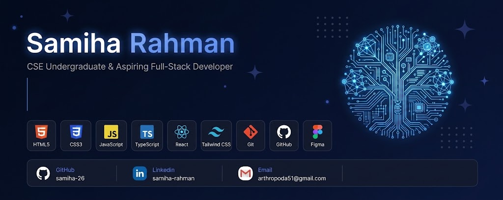

  

 

# **Hi 👋, I'm Samiha Rahman**

# 💫 About Me:
🎓 CSE Undergraduate 💻 Passionate about technology and web development 🌱 Currently learning HTML, CSS, JavaScript, React & TypeScript 🚀 Building projects and improving my development skills 🎯 Working toward becoming a full-stack developer 🧶 Outside of coding, I love crocheting and creating handmade pieces

## 🌐 Socials:
   

# 💻 Tech Stack:
               
# 📊 GitHub Stats:
 
 

### ✍️ Random Dev Quote

### 🐍 Git Contributions

  

